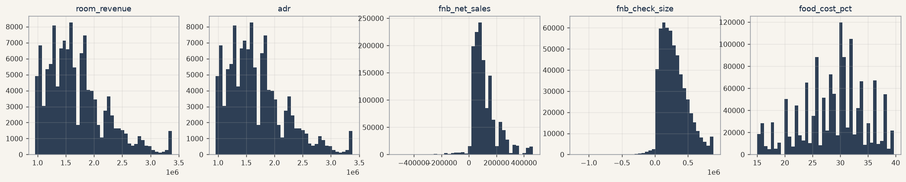
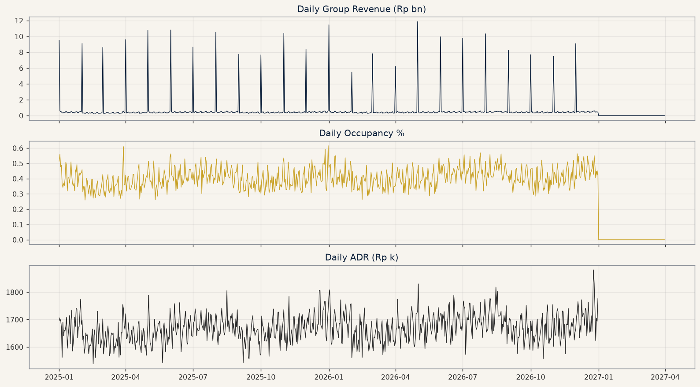
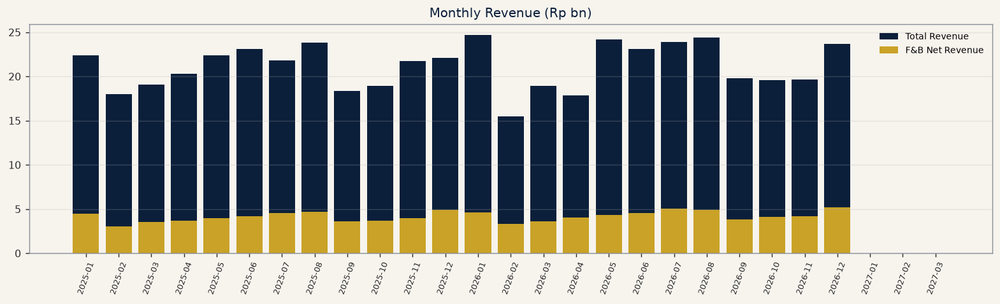
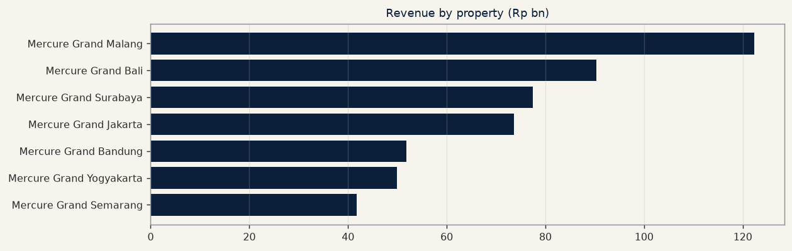
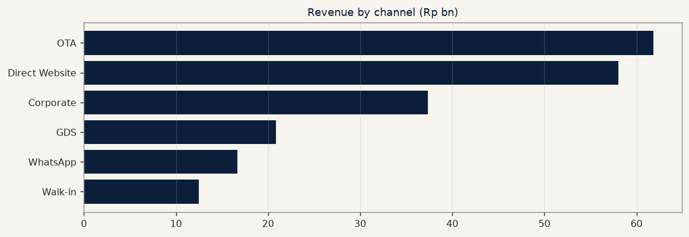
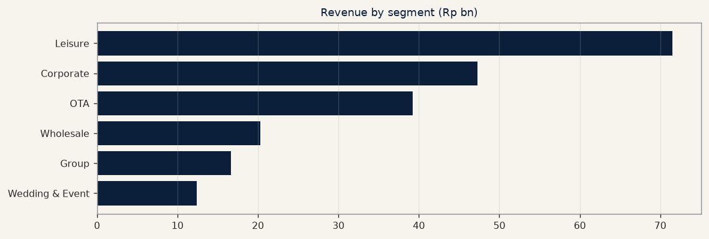
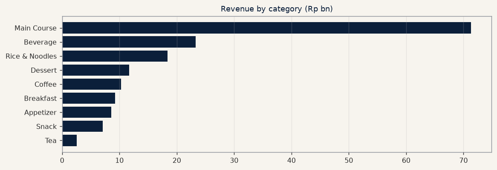

# EDA — Mercure Group Data Intelligence (Powered by LensaData)

Every figure below is computed from the warehouse marts.
Synthetic demonstration — all values fictional.

## 1. Dataset Overview

| Table | Rows |
|---|---|
| `dim_date` | 820 |
| `dim_property` | 9 |
| `dim_product` | 58 |
| `dim_account` | 37 |
| `fact_room_sales` | 136,253 |
| `fact_fnb_sales` | 1,402,546 |
| `fact_inventory` | 151,110 |
| `fact_purchase` | 16,813 |
| `fact_expense` | 7,439 |
| `fact_budget` | 6,789 |

## 2. Distributions

**room_revenue**: count=124,600, mean=1,697,180.86, std=525,241.50, min=960,000.00, p01=984,990.00, p05=1,036,000.00

**adr**: count=124,600, mean=1,697,180.86, std=525,241.50, min=960,000.00, p01=984,990.00, p05=1,036,000.00

**fnb_net_sales**: count=1,385,696, mean=115,805.25, std=95,551.76, min=-528,349.74, p01=-86,981.82, p05=24,188.32

**fnb_check_size**: count=555,804, mean=288,718.45, std=203,317.42, min=-1,184,357.38, p01=-38,000.00, p05=39,323.92

**food_cost_pct**: count=1,361,022, mean=28.68, std=5.81, min=15.00, p01=15.00, p05=18.00

## 3. Time Series

## 4. Segmentation

**By property**: Mercure Grand Malang=122.33bn, Mercure Grand Bali=90.36bn, Mercure Grand Surabaya=77.51bn, Mercure Grand Jakarta=73.64bn, Mercure Grand Bandung=51.77bn, Mercure Grand Yogyakarta=49.94bn, Mercure Grand Semarang=41.69bn

**By channel**: OTA=61.83bn, Direct Website=58.06bn, Corporate=37.37bn, GDS=20.86bn, WhatsApp=16.67bn, Walk-in=12.45bn

**By segment**: Leisure=71.53bn, Corporate=47.31bn, OTA=39.24bn, Wholesale=20.32bn, Group=16.63bn, Wedding & Event=12.39bn

**By category**: Main Course=71.32bn, Beverage=23.28bn, Rice & Noodles=18.39bn, Dessert=11.67bn, Coffee=10.28bn, Breakfast=9.24bn, Appetizer=8.60bn, Snack=7.08bn

## 5. Outliers (statistical)

**daily_revenue**: 24 high outliers (z>3), 0 low (z<-3)

**occupancy**: 0 high outliers (z>3), 0 low (z<-3)

**food_cost**: 1 high outliers (z>3), 1 low (z<-3)

**fnb_transactions**: 0 high outliers (z>3), 0 low (z<-3)